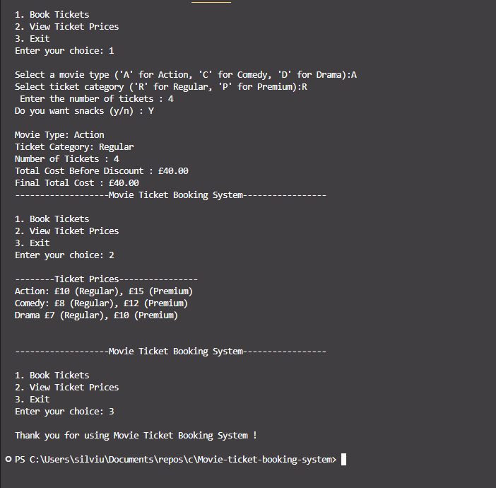

# Movie-ticket-booking-system

This project is a menu-driven movie ticket booking system written in C.
It demonstrates the use of:

Switch statements for menu navigation.

Logic conditions for discounts and validation.

Loops to allow repeated interaction without restarting the program.

Arithmetic operators to calculate totals.

The system allows users to book tickets, view ticket prices, and exit the program.

⚙️ Features

1. Menu System (Switch-based)

Option 1: Book Tickets

Option 2: View Ticket Prices

Option 3: Exit Program

2. Continuous Interaction

The menu loops until the user chooses to exit.

3. Input Validation

Movie type: A (Action), C (Comedy), D (Drama).

Ticket category: R (Regular), P (Premium).

Number of tickets: Must be greater than 0.

4. Booking Summary

When booking tickets, the program displays:

Movie type and ticket category

Number of tickets

Total cost before discount

Bulk discount (10% for 5–9 tickets, 20% for 10+)

Snacks cost (if selected)

Final total cost

🎟️ Ticket Prices
Movie Type Regular (£) Premium (£)
Action 10 15
Comedy 8 12
Drama 7 10
💰 Discounts

5–9 tickets: 10% discount

10+ tickets: 20% discount

🚀 How to Compile & Run
gcc movie_ticket_booking.c -o booking
./booking
[]
📝 Example Interaction
--- Movie Ticket Booking System ---

1. Book Tickets
2. View Ticket Prices
3. Exit
   Enter your choice: 1
   Select a movie type ('A' for Action, 'C' for Comedy, 'D' for Drama): A
   Select ticket category ('R' for Regular, 'P' for Premium): P
   Enter the number of tickets: 8
   Do you want snacks (y/n): n

--- Booking Summary ---
Movie Type: Action
Ticket Category: Premium
Number of Tickets: 8
Total Cost Before Discount: £120.00
Bulk Discount: £12.00
Final Total Cost: £108.00

---

--- Movie Ticket Booking System ---

1. Book Tickets
2. View Ticket Prices
3. Exit
   Enter your choice: 2

--- Ticket Prices ---
Action: £10 (Regular), £15 (Premium)
Comedy: £8 (Regular), £12 (Premium)
Drama: £7 (Regular), £10 (Premium)

--- Movie Ticket Booking System ---

1. Book Tickets
2. View Ticket Prices
3. Exit
   Enter your choice: 3
   Thank you for using the Movie Ticket Booking System!
